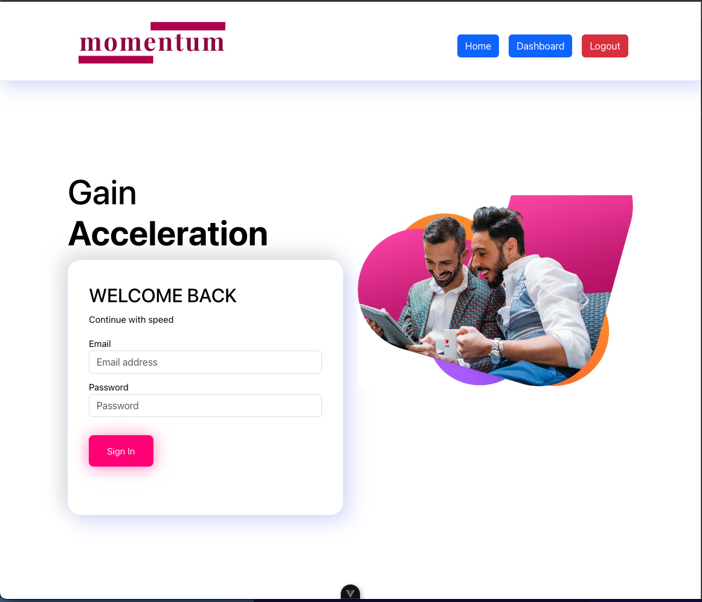
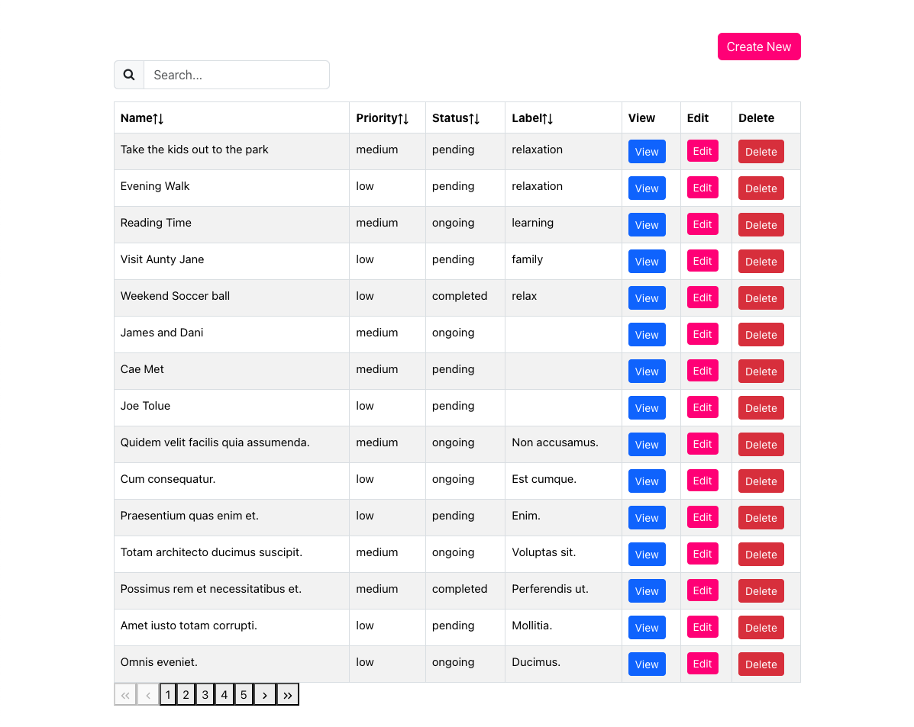
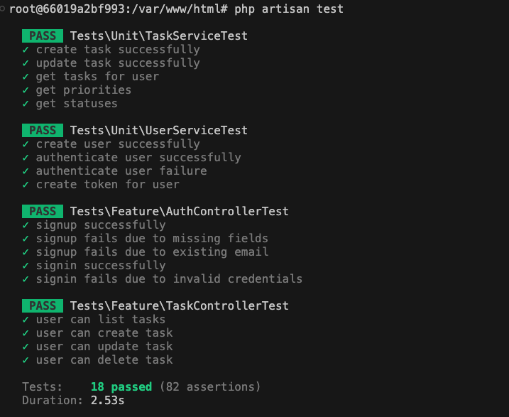

# MOMENTUM

 Task management platform, with ability to create an unlimited number of sub tasks.

## Tech Stack
-  Docker
- PHP v8
- NGINX for reverse proxy
- TypeScript
- MySQL
- Vue 3

 
 
 

## Installation
- Unzip project code or clone from repo
- CD into root directory
- `cp .env.example .env`
- Fillup all necessary variables in `.env`
- RUN `docker compose up --build -d --wait`
- CD into php container `docker exec -it momentum-php bash`
- RUN `composer install`
- RUN `php artisan key:generate`
- RUN `php artisan migrate`
- RUN CLI `localhost:5173`